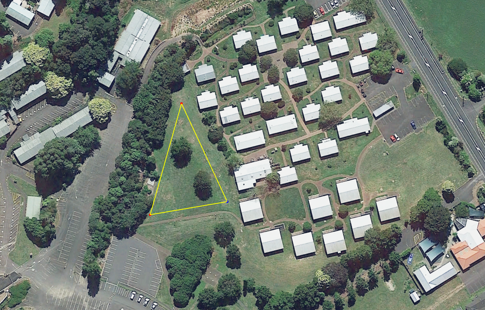
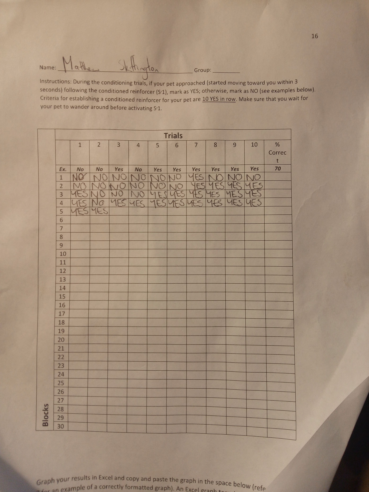
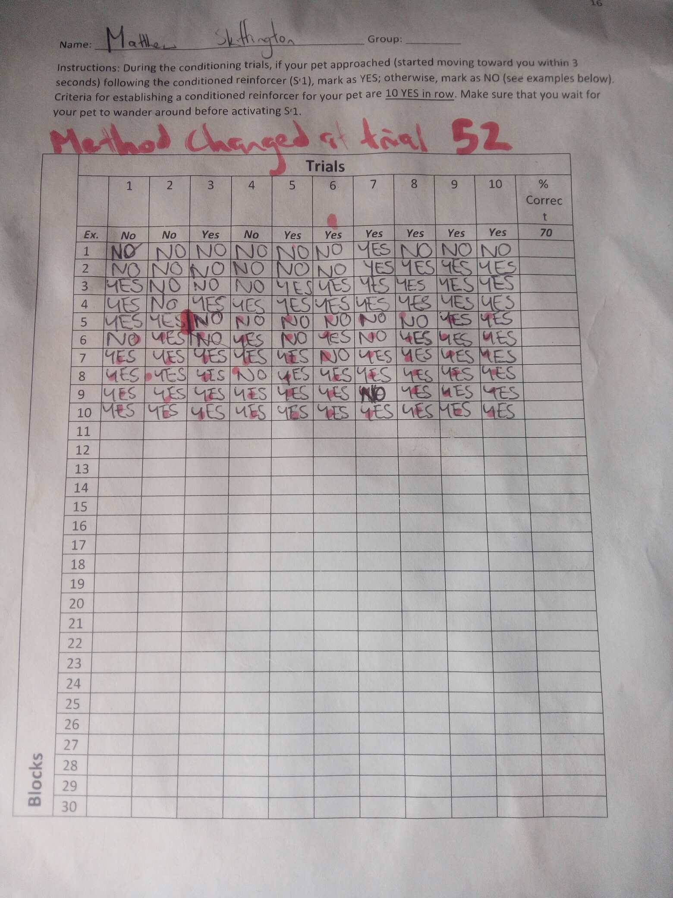

<style type="text/css">

h1.title {
  text-align: center;
}
h3.subtitle {
  text-align: center;
}
h4.author { /* Header 4 - and the author and data headers use this too  */

  text-align: center;
}
h4.date { /* Header 4 - and the author and data headers use this too  */
  font-size: 18px;
  text-align: center;
}
</style>

```{r setup, include=FALSE}
library(knitr)
library(magrittr)
library(ggplot2)
library(dplyr)
library(tibble)
library(stargazer)
library(kableExtra)
library(gridExtra)
opts_chunk$set(fig.width = 7)
opts_chunk$set(fig.height = 5)
opts_chunk$set(results = 'hold')
knitr::opts_chunk$set(echo = TRUE)
knitr::opts_chunk$set(results = 'hold')
knitr::opts_chunk$set(warning = F)
knitr::opts_chunk$set(message = F)
options(digits = 2)
```

# Preference Assessment

## Preamble

We choose the park area in the image below as the location for the conditioning assessment. This was because this is a quiet, secluded area that has enough space and is unlikely to have other animals nearby. This location is displayed below;



It was noted to us by the animal's owner that the animal had a tendency to attack other dogs on occasion. To further avoid this risk, the Murphy was kept on a leash at all times. The conditioning process took around 35-40 minutes. There was quite a lot of subjective decision making occuring when recording each trial as a yes or no. The data. The process was as follows;

* Wait until animal is wandering, not directly facing trainer, at ease and not directly next to trainer
* Use clicker $S^r$ and immediately offer $S^R$ by extending arm out with food
* IF pet moves towards trainer wthin 3 secs (either moves heads towards trainer or physically moves closer) - record YES for that trial
* ELSE record NO for that trial

The conditioning process was video recorded and this video file is available to project supervisors on the shared Google Drive directory. Unfortunately, one of the files does not have audio avaiable. We completed 42 trials using this format. The criteria for establishing a conditioned reinforcer was ten trials in a block.

After feedback from the project supervisor about the validty of the system we were using, it was decided we need to change the conditioing criteria, timing and method we were using. Previously;

* We were conducting trials with variable timing (sometimes over 30s between blocks)
* We more moving around while doing the reinforcing - not controlling other stimuli (our movement could act as a discriminative stimulus)
* We were using large biscuits, so it possibly Murphy was become satiated, reducing the effectiveness of the primary reinforcer

Hence we were instructred to adopt a new system;

* Quarter the pellets we used as reinforcers
* Stand still to avoid creating a discrimative stimulus
* Use the clicker then quicky (within 2 secs) feed Murphy a quarter pellet - repeat 15 times
* Stand 1m away from Murphy then activate clicker
* If we observed any indication (movement of head, being approached) showing he was expecting to recieve food, then we were to provide the conditioned reinforcer

We completed 58 trials under the new system. It was not neccesary to video record this second stage of data collection. I have clearly indicated in the graphs were this change in method occured.

## Raw data

There were three main video files documenting the conditioning process. These are available to view for members of PSYC314: Behaviour Analysis on the shared Google Drive directory. The raw data sheets are displayed below;





## Data Analysis

The data was entered into excel in long format and imported into R. "YES" was then recoded to 1 and "NO" to 0.  

As were were under time constraints and the weather was turning, we slighlty loosening the intial establishment criteria of 10 YES in a single block (i.e. from$y_i = 1 for i = 1,...,10$ or $i = 11,...,20$) to any 10 YES trials in a row (i.e. $y_i = 1$ for $i = n_k,...n_{k2}$ where $n_k2 - n_k \geq 10$). However, after discussion with the project supervisor, this approach was rejected in favour in performing another conditioning session. This dataset was combined with the first. Hence, $n = 42$ to $n = 100$ is data from the second session.

This dataframe, along with some basic frequency tables, is displayed below; 

```{r data sheet,results='hold'}
conditioning.df <- read.csv("Conditioned_Reinforcer_session1.csv") #import
kable(conditioning.df,caption = "Conditioned Reinforcer Data") %>%
  kable_styling("striped", full_width = T) %>%
  scroll_box(height = "200px")
cat("\n")
table(conditioning.df$Result) ->  x #freq tables
x <- as.data.frame(x)
colnames(x) <- c("Trial Result","Frequency")
cat("\n")
kable(x,caption = "Trial result frequency") %>%
  kable_styling("striped", full_width = T); rm(x)
cat("\n")
x <- table(conditioning.df$Session.No.)
x <- as.data.frame(x) 
colnames(x) <- c("Session","Number of Trials")
cat("\n")
kable(x,caption = "Session trials frequency") %>%
  kable_styling("striped", full_width = T)

conditioning.df$Result <- as.character(conditioning.df$Result) #recoding
conditioning.df$Result[conditioning.df$Result == "YES"] <- 1
conditioning.df$Result[conditioning.df$Result == "NO"] <- 0
conditioning.df$Result <- as.numeric(conditioning.df$Result)
```

The raw data is plotted below. Obviously, fitting a LOESS curve with a confidence interval (grey shaded region) is an inappropriate way of handling probabilistic data, but it gives an idea of trend between YES and NO trial outcomes. 

```{r raw data,results='hold'}
ggplot(data = conditioning.df) + geom_smooth(mapping = aes(x = Run.No.,y = Result),method = 'loess') + geom_vline(xintercept = 42,color = "red",width = 2) + theme_light() + labs(title = "Plot of Trial result versus Run No using LOESS",subtitle = "Vertical red line indicates change in method (2nd session)",caption = "original data points overlaid") + ylab("Result, 1 = Y, 0 = N") + xlab("Run") + xlim(0,100) + geom_point(mapping = aes(x = Run.No., y = Result))
```

We were required to plot the sequential probabilities of trial success for each block. This was calculated and plotted.

```{r plotted probabilities,results='hold'}
conditioning.df$Block_probability <- conditioning.df$Block_probability #assigning p(block) to all rows using a loop
for(i in 1:nrow(conditioning.df)) {
    conditioning.df$Block_probability[conditioning.df$Block.No. == i] <- mean(conditioning.df$Result[conditioning.df$Block.No. == i])
}

ggplot(data = conditioning.df) + geom_line(mapping = aes(x = Block.No., y = Block_probability)) + theme_light()  + theme(panel.grid.minor.x = element_blank()) + geom_point(mapping = aes(x = Block.No., y = Block_probability), size = 3, shape = "triangle") + labs(title = "Plot of Probability of Trial Success versus Block Number",subtitle = "Vertical red line indicates change in method (2nd session)",caption = "original data points overlaid") + ylab("Block Probability") + xlab("Block Number") + xlim(0,10) + ylim(0,1) + geom_vline(xintercept = 4.2,color = "red",lwd = 1) + scale_x_continuous(breaks = c(1:10))
```

For the sheer sake of curiosity, we can fit a logistic general linear regression model and plot the probability of trial success by trial number. This gives us the probability of trial sucess by trial number. We can note a few obvious problems with this model, the most obvious of which is that a very low probability of trial success (less than 0.25) would require (the clearly impossible scenario of) negative trials! 

We could extrapolate our model to cover trial numbers not in the original data, i.e. 100-200 trials. Extrapolating outside the original data range is an action that should be done with extreme caution. This extrapolation is shown in the second graph below.

```{r logistic regression,results = 'asis'}
conditioning.df$Result <- as.factor(conditioning.df$Result)
conditioning.glm <- glm(data = conditioning.df, Result ~ Run.No.,family = "binomial") #link default is logit
stargazer(conditioning.glm, align = T, type = "html", omit.stat = c("aic","bic","ll"))
conditioning.glm$coefficients -> logistic.coefficients.vec
```
```{r graph logistic,fig.height = 12,results='hold'}
#block_no <- sort(unique(conditioning.df$Block.No.))
trial_no <- seq(from = 0, to = 100, by = 0.01)
trial_logits <- logistic.coefficients.vec[1]+ logistic.coefficients.vec[2]*trial_no #intercept + coefficient*trial no.
#this gives log(p/(1-p))
trial_probs <- exp(trial_logits)/(1 + exp(trial_logits)) # turning odds ration to probability: odds / 1 + odds 

logit_conditioning.df <- as.data.frame(cbind(trial_no, trial_probs)) #binding x and y variables

condition_logistic.g <- ggplot(logit_conditioning.df, aes(x = trial_no, y = trial_probs)) + geom_line() + theme_light() + theme(panel.grid.minor.x = element_blank()) + labs(title = "Logistic Regression of Trial Success versus Run No.") + ylab("P(Trial Sucess)") + xlab("Trial") + xlim(0,100) + ylim(0,1) + scale_x_continuous(breaks = seq(from = 0, to = 100, by = 10))

rm(trial_no,trial_probs,logit_conditioning.df,trial_logits)

#extrapolating model
trial_no <- seq(from = -100, to = 200, by = 0.01)
trial_logits <- logistic.coefficients.vec[1]+ logistic.coefficients.vec[2]*trial_no #intercept + coefficient*trial no.
#this gives log(p/(1-p))
trial_probs <- exp(trial_logits)/(1 + exp(trial_logits)) # turning odds ration to probability: odds / 1 + odds

logit_conditioning.df <- as.data.frame(cbind(trial_no, trial_probs)) #binding x and y variables
extrap_conditioned_logistic.g <- ggplot(logit_conditioning.df, aes(x = trial_no, y = trial_probs)) + geom_line() + theme_light() + theme(panel.grid.minor.x = element_blank()) + labs(title = "Extrapolated Logistic Regression of Trial Success versus Run No.") + ylab("P(Trial Sucess)") + xlab("Trial") + xlim(-100,200) + ylim(0,1) + scale_x_continuous(breaks = seq(from = -100, to = 200, by = 10)) + theme(axis.text.x = element_text(angle = 45, hjust = 1))

grid.arrange(condition_logistic.g,extrap_conditioned_logistic.g)
```


## Conclusion

We reached our conditioning criteria in final block, where we achieved ten yes trials in a row, such that probability of sucess = 1.0. Hence, we can work on the assumption we have established a conditioned reinforcer for Murphy, which leads into Stage 3: Shaping. 
